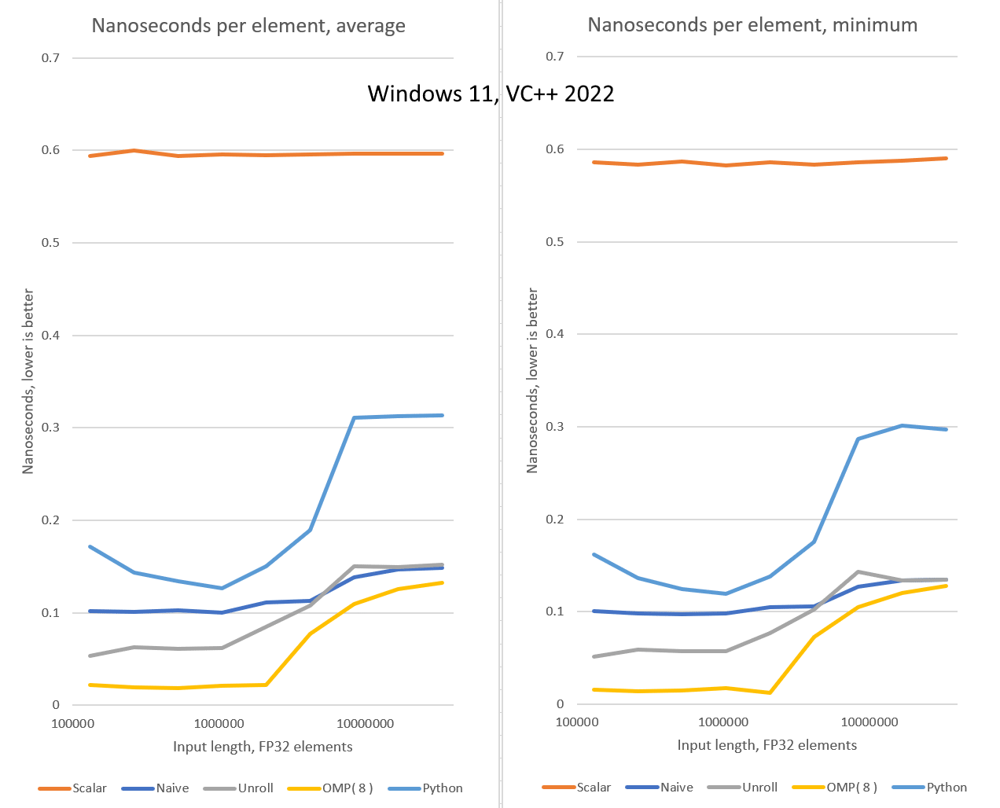

# Cosine similarity in C++ and SIMD

This post is a response to [this article](https://joseprupi.github.io/misc/2024/07/08/cosine-similarity-simd-implementation.html) by Josep Rubió Piqué.

Specifically, I’ve implemented two faster SIMD versions of the same algorithm in C++:

* One is a manually unrolled version that uses 4 sets of accumulators to workaround the relatively high latency of FMA instructions.
* The other one does the same but also splits the work across 8 CPU threads using [OpenMP](https://en.wikipedia.org/wiki/OpenMP), hopefully running on 8 dufferent CPU cores.

Here’s the result from my desktop computer with a Ryzen 7 [8700G](https://www.amd.com/en/products/processors/desktops/ryzen/8000-series/amd-ryzen-7-8700g.html) processor.

Note the X-axis is logarithmic, while the Y-axis is linear.



The Excel file is available in the Results subfolder.

As you can see, I couldn’t reproduce the original author's results.
On my machine, Python was faster than scalar C++ but slower than even the naïve SIMD version.

I don’t think this means there’s anything wrong with the original article.\
The most likely explanation is that I’m not great with Python. The original author probably did a better job setting up the dependencies.
I spent 15 minutes trying a few things, but even with ChatGPT’s help, 
I couldn’t get the `np.dot` and `np.linalg.norm` functions to use multiple CPU cores on either Windows 11 or Ubuntu Linux.

I’m using WSL1, which is a thin compatibility layer rather than a virtual machine.
For a numerical benchmark that doesn’t make any system calls, I’m hoping the performance is quite similar to running on native Linux.\
The parallel version needs a few system calls to spawn and join threads, but it only does it once for the complete buffer.
I hope the performance cost of that is negligible, at least for long inputs.

## Build Instructions

### Windows

Install Visual Studio 2022; I’m using the freeware community edition.

Clone this repository

Double click on the `CosineSimBench\CosineSimBench.sln`, switch to Release configuration, and build.

### Linux

Clone this repository, then run the following commands:

```
sudo apt install -y build-essential cmake gcc g++
cd CosineSimBench
mkdir build
cd build
cmake ../
make
```